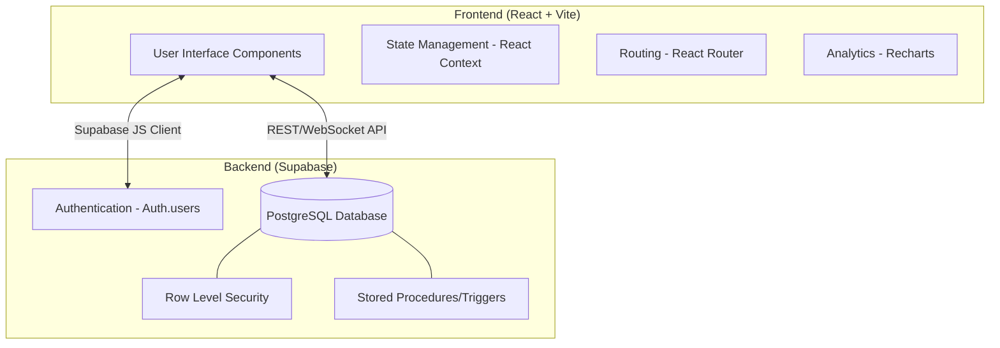
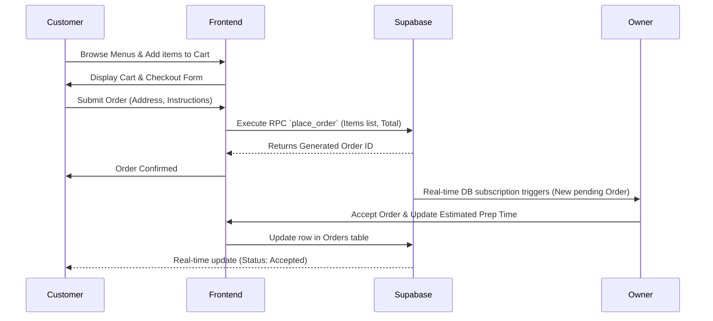
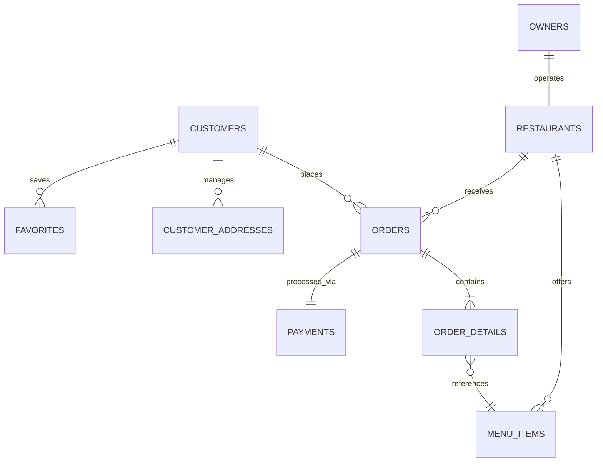

# FoodOS - Full Stack Food Delivery Platform

## Overview
FoodOS is a comprehensive, full-stack food delivery application built with modern web technologies. Designed for seamless user engagement, it connects food enthusiasts with local restaurants, providing a smooth browsing and ordering experience, real-time tracking, and powerful business management dashboards for restaurant owners.

## Tech Stack
**Frontend**: React.js (v18), Vite, Tailwind CSS, Material-UI (MUI), Framer Motion & GSAP (Animations), Recharts (Analytics Data Visualization), Leaflet (Maps).  
**Backend**: Supabase (PostgreSQL Database, Authentication, Row Level Security, Realtime Abstractions).

## Key Features

### For Customers 🍕
- **Authentication**: Secure Login/Register flows integrated with Supabase Auth.
- **Discover**: Browse local restaurants, search for specific food items, read reviews, and explore curated deals and offers.
- **Order & Checkout**: Advanced shopping cart, real-time total calculation. Add specific instructions to order items, manage multiple delivery addresses.
- **Tracking**: Real-time order status tracking with order dispatch and preparation time estimations.
- **Personalization**: Unique user profiles carrying favorited items, favorite restaurants, and complete detailed order history.

### For Restaurant Owners 🏪
- **Owner Dashboard**: Secure dashboard to operate the business utilizing Role-Based Access Control (RBAC).
- **Menu Management**: Full capability to create, update, and manage menu categories and individual items with associated imagery and pricing.
- **Order Management**: Receive orders in real-time. Ability to accept incoming orders, update estimated prep time, mark as dispatched, and view special customer instructions.
- **Analytics Dashboard**: Immersive charts (powered by Recharts) that detail live revenue generation, order volume, and top-selling popular dishes.

---

## Architectural Overview

Below is the high-level architecture detailing the interaction between the React frontend components and the Supabase backend services.



## System Data Flow 

A standard procedure outlining a customer placing an order and the restaurant owner fulfilling it, emphasizing bidirectional real-time capabilities.



## Database Entity Relationship

A simplified Entity Relationship (ER) overview of the core structures mapping the PostgreSQL database handled inside Supabase.



---

## Getting Started

### Prerequisites
- Node.js (v18 or higher)
- npm or yarn
- Supabase Project (Database & Auth details ready)

### Local Installation

1. **Clone the repository and navigate to the frontend directory:**
   ```bash
   git clone <repo-url>
   cd FoodOS-main/frontend
   ```

2. **Install dependencies:**
   ```bash
   npm install
   ```

3. **Environment Setup:** 
   Create a `.env` file in the `frontend/` directory and configure your Supabase connection strings:
   ```env
   VITE_SUPABASE_URL=your_supabase_project_url
   VITE_SUPABASE_ANON_KEY=your_supabase_anon_key
   ```

4. **Database Setup:**
   Run the provided SQL files situated in the root directory via your Supabase SQL Editor in the proper order to provision your backend:
   1. `supabase_schema.sql` - Bootstraps all base schema architecture.
   2. `upgrade_schema.sql` - Upgrades tables with extra columns like trackings, instructions, and handles `favorites` tables.
   3. `security_policies.sql` - Enforces strict row level security allowing multi-tenant safe operations.
   4. `upgrade_tracking.sql` - Enhances dispatch configurations.
   5. `seed_data.sql` - Populates the database with realistic placeholder entries allowing for immediate test execution. 

5. **Start the development server:**
   ```bash
   npm run dev
   ```

6. Open your browser and navigate to `http://localhost:5173`.

## Project File Structure
```
frontend/
├── src/
│   ├── components/     # Modular React components (Cards, lists, navbars, models)
│   ├── pages/          # Full routed page views (Home, Profile, Dashboard, Menus)
│   ├── context/        # React Context logic (Auth, Cart providers)
│   └── assets/         # Static global assets
├── public/             # Public static files
├── package.json        
└── .env                # Strict Environment variables
```
